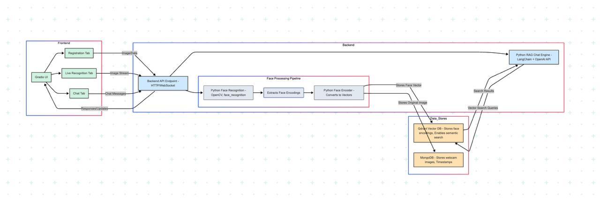

# Architexture Diagram :


# Core Functionalities

•⁠  ⁠Face Registration: Capture and store webcam images with timestamps in MongoDB.
•⁠  ⁠Face Encoding & Vectorization: Convert facial images into embeddings using a Pickle-based pipeline and store them in Qdrant.
•⁠  ⁠Live Recognition: Stream webcam input and recognize registered faces in real-time.
•⁠  ⁠AI Q&A Interface:Ask semantic questions (e.g., "Who was the last registered person?") using LangChain + OpenAI.

• Qdrant offers vector search with built-in filtering, payload support, and distributed scalability. Unlike Faiss, it provides a production-ready API with persistent storage and easy deployment.

 Registration
•⁠  ⁠Captures webcam images.
•⁠  ⁠Assigns a user name and stores the image and metadata in MongoDB.
•⁠  ⁠Converts image to face embeddings and stores in Qdrant DB.

 Real-Time Recognition
•⁠  ⁠Reads from webcam.
•⁠  ⁠Compares live embeddings with stored vectors.
•⁠  ⁠Displays recognized names with bounding boxes.

 AI Chat Interface
•⁠  ⁠Users can ask natural-language questions about the data.
•⁠  ⁠Uses LangChain, Qdrant, and OpenAI to perform semantic search and answer.


 ### Tech Stack

|---------------------------------------------------------------------|
| Module            | Technology                                      |
|-------------------|-------------------------------------------------|
| Frontend          | Gradio                                          |
| Backend           | Python Flask                                    |
| Face Recognition  | Python (⁠ face_recognition ⁠, ⁠ OpenCV ⁠)           |
| RAG Engine        | Python (⁠ LangChain ⁠, ⁠ Qdrant ⁠, ⁠ OpenAI ⁠)        |
| Image Storage     | MongoDB                                         |
| Embedding Storage | Qdrant                                          |
| Environment       | ⁠ .env ⁠ (for keys, URIs, config)                 |
-----------------------------------------------------------------------

 1. Install Dependencies
```bash
pip install -r requirements.txt
```

 2. Install System Dependencies (Linux/Mac)
```bash
# For face_recognition library
sudo apt-get install cmake
sudo apt-get install libopenblas-dev liblapack-dev
sudo apt-get install libx11-dev libgtk-3-dev

# For OpenCV
sudo apt-get install python3-opencv
```
 3. Install and Setup MongoDB
bash
 ``` bash
sudo apt-get install mongodb

 Start MongoDB service
sudo systemctl start mongodb
sudo systemctl enable mongodb

 Verify MongoDB is running
mongo --eval "db.adminCommand('listCollections')"

```
 4. Install and Setup Qdrant
```bash
# Using Docker (Recommended)
docker run -p 6333:6333 qdrant/qdrant

# Or install from source
git clone https://github.com/qdrant/qdrant.git
cd qdrant
cargo build --release
./target/release/qdrant

```
### 5. Configure Environment Variables
``` bash
Create a .env file in the project root:
env
OPENAI_API_KEY=your-openai-api-key-here
MONGODB_URL=mongodb://localhost:27017/
QDRANT_URL=localhost
QDRANT_PORT=6333
```

## Running the System

### 1. Start Backend Server

### Navigate to backend directory
``` bash
python fastapi_backend.py
```

### Or using uvicorn directly
``` bash
uvicorn fastapi_backend:app --host 0.0.0.0 --port 8000 --reload
```
The backend will be available at: http://localhost:8000

### 2. Start Frontend

### In a new terminal
``` bash
python Ui_frontend.py
```

The frontend will be available at: http://0.0.0.0:7860

## API Endpoints

### Backend API Documentation
Once the backend is running, visit: http://localhost:8000/docs for interactive API documentation.

### Available Endpoints:
•⁠  ⁠POST /register - Register a new face
•⁠  ⁠POST /recognize - Recognize a face
•⁠  ⁠POST /ask - Ask AI questions about registered faces
•⁠  ⁠GET /faces - List all registered faces
•⁠  ⁠GET /health - Health check

## Usage Guide

### 1. Register Faces
•⁠  ⁠Go to the "Register" tab
•⁠  ⁠Choose capture method (Upload, Camera, or Stream)
•⁠  ⁠Enter person's name
•⁠  ⁠Capture/upload image
•⁠  ⁠Click "Register Face"

### 2. Recognize Faces
•⁠  ⁠Go to the "Recognize" tab
•⁠  ⁠Choose recognition method
•⁠  ⁠Capture/upload image
•⁠  ⁠Click "Recognize Face"
•⁠  ⁠View results with confidence score

### 3. Ask AI Questions
•⁠  ⁠Go to the "Ask AI" tab
•⁠  ⁠Try sample questions or enter custom ones
•⁠  ⁠Examples:
  - "Who was the last person registered?"
  - "How many people are registered?"
  - "List all registered people"
  - "When was John registered?"

### 4. View Registered Faces
•⁠  ⁠Go to the "View Faces" tab
•⁠  ⁠See all registered faces with timestamps


“This project is a part of a hackathon run by https://katomaran.com ”


